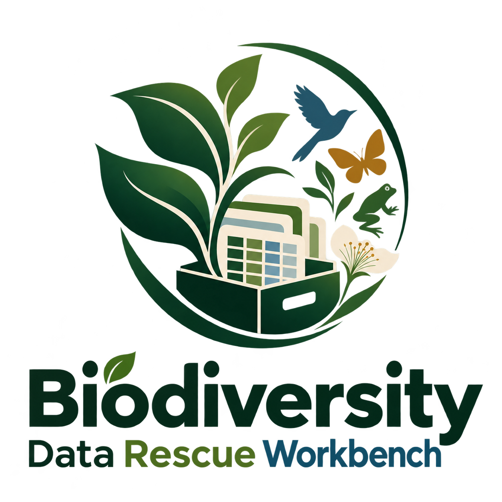
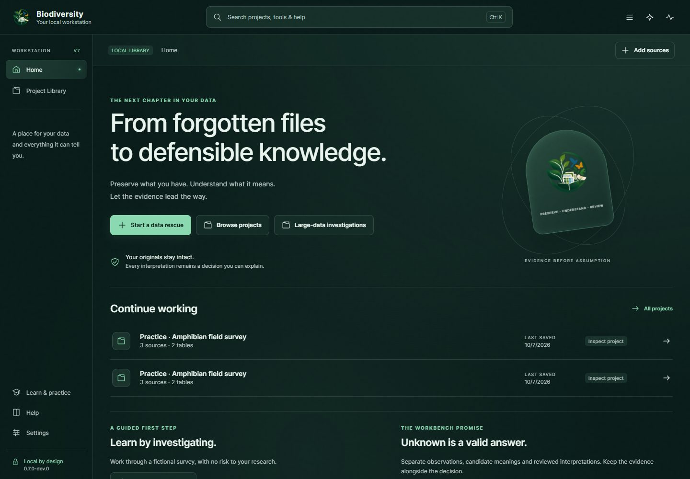
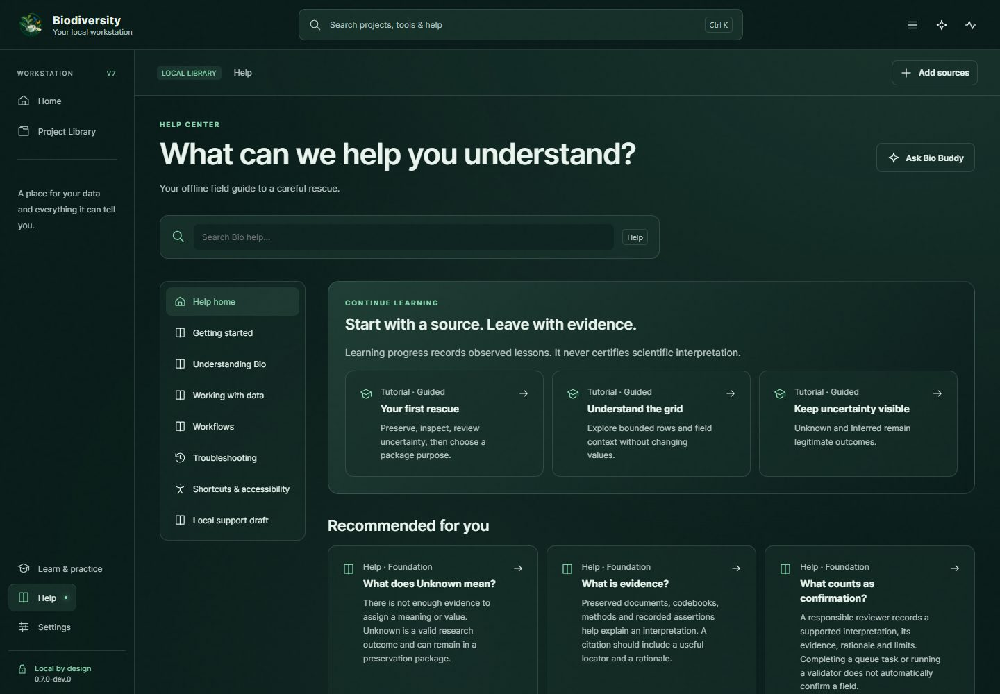
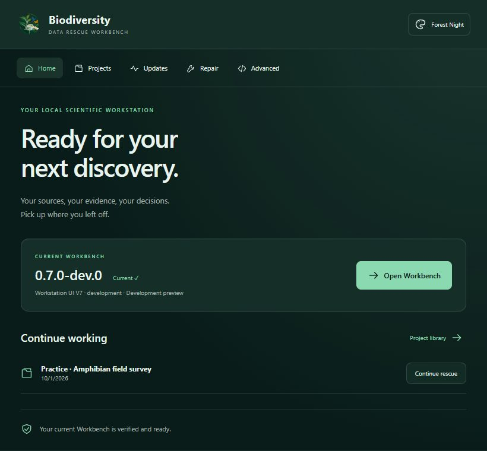

# Biodiversity Data Rescue Workbench

**Give messy biodiversity data a careful second life.**

A local-first workbench for preserving original files, investigating uncertain data, reviewing repairs, and leaving a clear record of what changed—and what remains unknown.

## What is Bio?

Bio helps researchers, collection managers, and data stewards work with legacy spreadsheets, inconsistent tables, document evidence, and incomplete explanations. Keep the source intact, inspect what can be recovered, and make each interpretation an explicit, reviewable decision.

## Why data rescue?

A dataset can outlive its software, field notes, or original team. A blank cell, an undocumented code, and a recorded zero have different meanings. Rescue starts by preserving those differences, rather than making uncertain data look complete.

## What Bio can do

| Your task | How Bio helps |
| --- | --- |
| Preserve | Retain original bytes and inspect extraction before accepting working tables. |
| Investigate | Explore literal values, evidence, relationships, and unresolved questions. |
| Repair | Preview changes, review their scope, and retain an undoable history where supported. |
| Validate | Check local structure and standards-oriented constraints with visible limits. |
| Package | Prepare reviewed exports and preservation packages with provenance and evidence. |
| Learn | Follow guided lessons, search the Help Center, and consult Bio Buddy. |

Some advanced workflows remain in the retained interface. Structural validation does not establish scientific truth or certify complete standards conformance.

## Core principles

- **Preserve originals.** Keep retained source bytes separate from working values.
- **Keep uncertainty visible.** Unknown, inferred, and conflicting meanings deserve a place.
- **Never silently invent meaning.** Interpretation requires evidence and human review.
- **Make changes reviewable.** Keep provenance and recovery paths explicit.
- **Local first.** Research stays on your machine unless you deliberately choose to share it.

## Screenshots

Current V7 interface previews with fictional data. These are browser-rendered previews; final live Windows visual acceptance is still pending. The launcher preview uses fictional installation status.

## Getting started

Public downloads will become available from [GitHub Releases](https://github.com/amgedi/Biodiversity-Data-Rescue-Workbench/releases) with the first release. **No stable release is available yet.** For a source build, follow [build and test](docs/build.md).

With a development portable package:

1. Extract the complete archive into a writable folder and verify its checksums.
2. Open **Launch Workbench.exe**, then **Open Workbench**.
3. Start with **Learn & practice** and a fictional project.
4. Choose **Add sources**, inspect the extraction, and preserve the source before reviewing changes.

## A typical rescue

**Preserve → Inspect → Repair → Validate → Export**

Retain the files and their context. Examine literal values and missingness. Preview a repair, record the basis for interpretation, and check the result. Export with enough evidence for the next person to understand your decisions.

## Major capabilities

**Sources and evidence:** delimited tables, spreadsheet/document evidence, original-file integrity checks, and retained supporting material. Reader fidelity varies; inspect originals before relying on extracted text.

**Review and repair:** working tables, relationship-aware investigations, explicit uncertainty, reviewed transformations, and recoverable project history.

**Validation and packaging:** local checks, standards-oriented mapping/export tools, preservation packages, and bounded large-data investigations. Large-data and advanced workflows have their own scope and may use the retained interface; no unlimited-size claim is made.

**Help and learning:** guided tutorials, a searchable Help Center, and **Bio Buddy**, a local learning and workflow assistant based on curated guidance. Bio Buddy does not provide automatic scientific interpretation.

## Privacy and data safety

The Workbench has no silent project uploads. Optional external analysis providers, where available in retained tools, require explicit consent; review the chosen provider and payload first. Bio Buddy works locally. Manually checking for updates contacts GitHub; opening a support page contacts the selected external service. Neither action sends project content.

Working storage is not encrypted. Projects normally live under `%LOCALAPPDATA%\Biodiversity Data Rescue Workbench\projects-data`. Packages and support details can contain originals, precise locations, contacts, and history. Review them before sharing. **A saved project is not an independent backup.** See [data safety](docs/data-safety.md).

## Installation and project status

Current version: **0.7.0-dev.0**. Bio is in early development ahead of its first public release. Windows x64 and WebView2 are required. Development binaries are unsigned. Packaged use does not require Python or Node; source builds need the documented toolchain.

The portable distribution includes the launcher and selected runtime; keep all folders together. Installer distribution and stable release acceptance are not claimed. See [architecture](docs/architecture.md) and [build instructions](docs/build.md) for development details.

## Contributing

Bug reports, accessibility feedback, documentation, and carefully scoped fixes are welcome. Use fictional or minimized examples, preserve uncertainty, and read [CONTRIBUTING.md](CONTRIBUTING.md). Cite the software using [CITATION.cff](CITATION.cff).

## Security

Please do not post credentials, confidential research, or exploit details publicly. Follow [SECURITY.md](SECURITY.md) for reporting guidance.

## Support the project

Biodiversity Data Rescue Workbench is free and open source. If it saves you time or helps recover a dataset, you can support continued development, testing, documentation, accessibility, and research-software maintenance.

[GitHub Sponsors](https://github.com/sponsors/amgedi) · [Ko-fi](https://ko-fi.com/openfhs)

Support is always optional. Every feature remains free. Quiet reminders can be disabled in **Settings → About**.

## License

Original project code is licensed under **AGPL-3.0-only**. See [LICENSE](LICENSE). Third-party components retain their own licenses and attribution; see [THIRD_PARTY_NOTICES.md](THIRD_PARTY_NOTICES.md).
